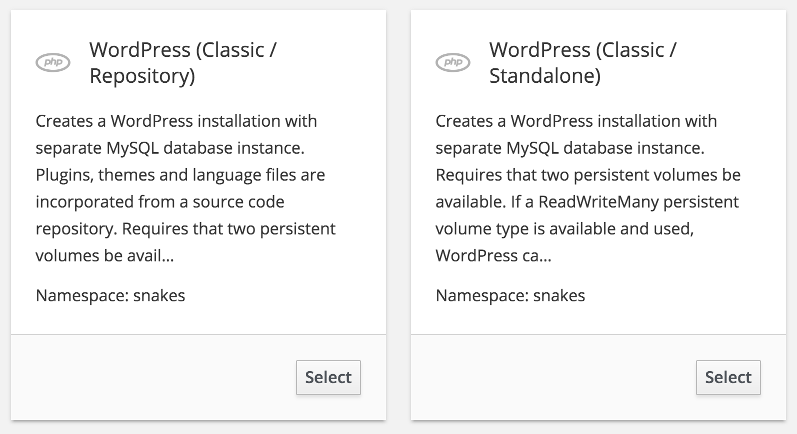
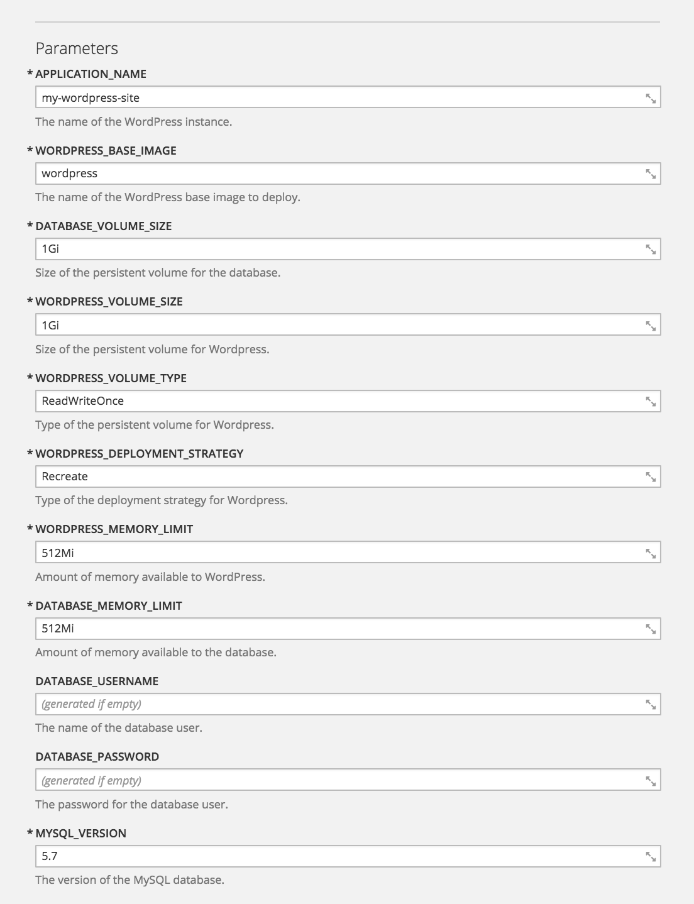
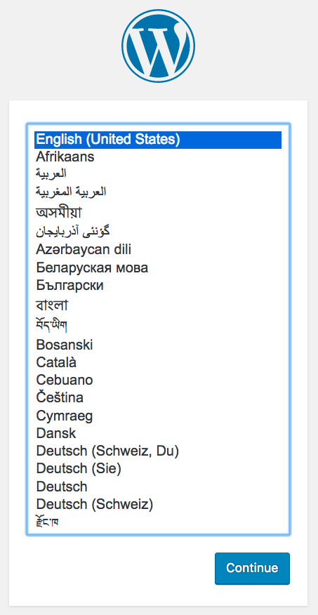
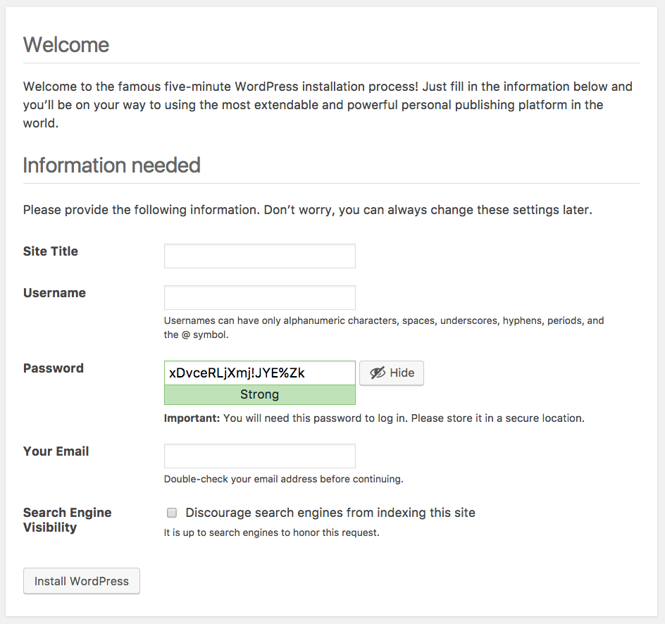
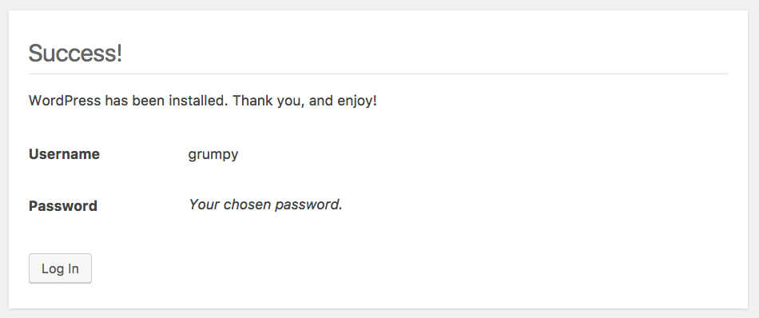

WordPress Quickstart
====================

This repository implements a way of quickly deploying WordPress to OpenShift 3.

Provided in the repository are OpenShift templates for deploying WordPress in a number of different configurations suitable for production and testing environments.

These include the ability to deploy a self contained standalone instance of WordPress where all data related to the instance is maintained in a persistent volume. Plus, the ability to deploy an instance of WordPress where plugins, themes and language files can be stored in a source code repository and incorporated into the WordPress instance by re-building the application to include them.

Because the repository contains custom S2I scripts, which will be pulled down every time a re-build of the application image occurs, it is recommended that you create your own fork of the repository and work from it. This will ensure that you are using a stable version of the scripts and will not be affected by future changes made to this repository. You can update your fork from this repository later if you need future changes which may be made.

To fork the repository, use the **Fork** button on the home page for this repository on GitHub.

Creating the WordPress Image
----------------------------

The primary purpose of this source repository is to provide a way to build an image containing the bits required to run WordPress. The image created will fulfil two roles.

The first is that the image can be deployed directly as is if it were an application image. In this case it will result in a self contained standalone WordPress instance.

The second is to use the image as a S2I builder image. In this case a build would be run against a source repository containing plugins, themes and language files. These would be incorporated into the WordPress instance.

The latter would be used where you have a need to develop your own plugins, themes and language files and want them under version control in a source repository.

To create the WordPress image run the command:

```
oc new-build --name wordpress php:7.0~https://github.com/openshift-evangelists/wordpress-quickstart
```

In this example the URL of the original for this source repository is used. If you have created a fork of this repository, ensure you use the URL for your fork.

This will by default create an image which uses the latest version of WordPress available.

Loading the Templates
---------------------

Although you can use the WordPress image directly, manually setting all the required environment variables and linking it to a database, it is easier to use the provided templates to deploy it.

To load the templates into OpenShift from the command line you can run:

```
oc create -f templates/classic-standalone.json
oc create -f templates/classic-repository.json
```

Deploying WordPress
-------------------

To deploy a fresh WordPress instance, from the web console select _Add to Project_. Under _Browse Catalog_, select _PHP_. You should be presented with options for the templates you loaded.



Of these options, select _WordPress (Standard Standalone)_. This option will create a typical standard installation for running WordPress where everything is self contained within the persistent volume.

The configuration requires two persistent volumes be available. The default persistent volume type used for WordPress data will be _ReadWriteOnce_. This is the type of persistent volume which is normally available in OpenShift clusters hosted on cloud environments such as AWS, Google and Azure. This includes the hosted OpenShift Online service provided by Red Hat.

When this persistent volume type is all that is available, the WordPress instance cannot be scaled and the number of replicas should be left as 1.

If your OpenShift cluster has persistent volumes of type _ReadWriteMany_, you can instead use this persistent volume type. When this persistent volume type is used, you can scale up WordPress to more than 1 replica, and also enable _Rolling_ deployment strategy.

Select _WordPress (Standard Standalone)_ and you will be presented with a form to fill out details for the WordPress instance to be created.



Change the name of the WordPress instance if desired.

You can optionally set the database username and password. If you do not, these will automatically be filled in with generated values. You can retrieve the values later from the environment settings of the deployment configuration if you need to access the MySQL database directly. You do not need to know the values of the database username and password when doing the deployment.

Click on **Create** to deploy the WordPress instance and return to the _Overview_ in the OpenShift web console.

Configuring WordPress
---------------------

Once WordPress has finished building and is running, go to the WordPress site by clicking on the URL on the _Overview_ page of the OpenShift web console. The configuration created will ensure that a secure HTTP connection is used when performing any administration on the WordPress instance, or when logging into the WordPress site.

When the WordPress instance is created, it will be automatically configured with the database credentials to match the MySQL database which was also deployed by the template. Other settings necessary for running under OpenShift will also be automatically setup.

Upon visiting the WordPress site you should therefore bypass the initial setup usually required for WordPress. The first page you should arrive at will be that to select the language to use.



Select the language and click on **Continue**. You will be asked to provide the name for the WordPress instance and details of an initial user.



Fill in your details and click on **Install WordPress**. You will receive confirmation that setup of WordPress has been successful.



You can now log in to your WordPress instance and start using it.

Testing Environment
-------------------

If you want to play with WordPress to test out features, validate data migration steps etc, you can use test variants of the templates. These templates can be loaded by running:

```
oc create -f templates/testing-standalone.json
oc create -f templates/testing-repository.json
```

For these configurations, only a single persistent volume is required as the WordPress instance and the MySQL database are run together in the same pod and will share the one persistent volume. With these configurations, you can never scale WordPress up to more than 1 replica, nor enable rolling deployment strategy, even if you have _ReadWriteMany_ persistent volume type available. This restriction exists as scaling up WordPress will also scale up the number of MySQL database instances which would result in database corruption. These configurations are only recommended for testing.
